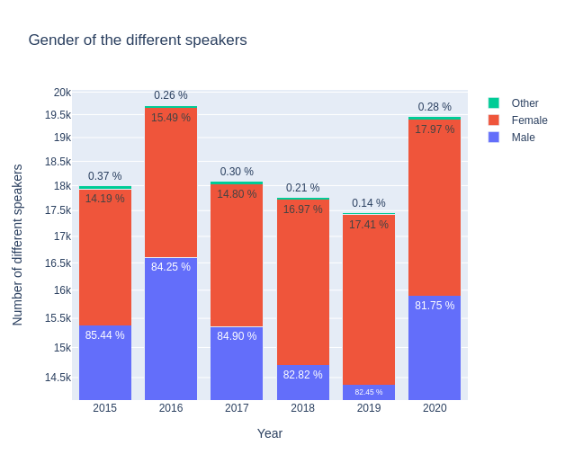

## Introduction 

It is very often the case that well-known personalities are quoted in speeches given by other individuals, creating a directional relationship from a speaker to a subject. These relationships occur between two persons with different characteristics, for example their occupation and their gender. As a result, these relationships can be multiple with (very) different natures, where some of these are perhaps more present than others.

This brings us to the question, how are these relationships distributed? In this article, we propose to study and understand the relationships between several individuals according to the occupation and gender of each person involved in a relationship. To do so, we want to establish a directed graph of relationships between speakers and people mentioned in the quotations. In particular, some of the questions that will be answered in this article are:

* Are these relationships uniform, i.e., involving people of the same occupation?
* How are the genders represented according to occupation in each relationship?
* Are these relationships likely to change over time?

## The data

In this study we use the Quotebank dataset, a dataset of 178 million unique, speaker-attributed quotations that were extracted from 196 million English news articles crawled from over **377 thousand web domains** between August 2008 and April 2020. We will focus on the years of **2015 to 2020**. 

Using SpaCy, we extract 100 000 quotations for each year (2015 to 2020) in which a speaker is talking about a human subject. After cleaning, we get the following amount of samples:

| Year | Number of quotations | Number of speakers | Number of subjects |
| --- | --- | --- | --- |
|2015|15970|8146|6060|
|2016|17392|7966|5814|
|2017|16389|8177|6009|
|2018|16111|7985|6063|
|2019|15946|7530|5583|
|2020|17498|7000|5274|

Presentation

\\

## Some occupations are at the heart of the relationships… (Part 1)

Graph with occupation : 2015

Analysis : relashionships ~ 2 paragraph 

\\

## … and often very gendered ones. (Part 2)

Graph with gender_occupation : 2015 :

<iframe src="./_includes/nt_2015.html"  width=500 height=130></iframe>

Analysis ~ 2 paragraph 

(Graph which gender/occupation talks to which gender/occupation ?)

We now want to look at what this data tells us about gender equality. Do men, women and other genders have the same visibility in the media in general?

 |
:--- | --- :
| ||

Clearly the answer is no. According to worldometers in 2013 there are 50.4 % of men and 49.6 % of women  in the world. Hence it seems that women are very underrepresented in the media. Indeed **women are the origin of less than 20 % of the quotes** that are reported in the media and are **5 times less likely than men to be spoken** about in the media.

We dig a bit more into gender inequality and want to know what are the occupations of the women represented in the media compared to men. TOO MUCH DATA? YES, TOMORROW I WILL MAKE ONE GRAPH WITH A MEAN FOR ALL YEARS AND SLIDES FOR MALE_SUBJECT, MALE_SPEAKER, etc

Let's start with the women occupations.

Most of the women present in the media are artists. There is also a few politicians.
We notice that although on repartition quite a lot of women which said quotes are involved in politics (throughout the years  always more than 17%) or are researchers, business persons, most of the women names found in quotes are artist names. And for politicians are way more represented as speakers than as subjects. 

Now what about the men occupations?

Most of the men present in the media are politicians, artists and sports players.

Let's dive deaper into this gender inequality and try to understand why women are that much underrepresented in the media.

We provide the following graph:

Graph which occupation talks to which occupation ?

\\
\\

## Towards an evolution in time? (Part 3)

Evolution

