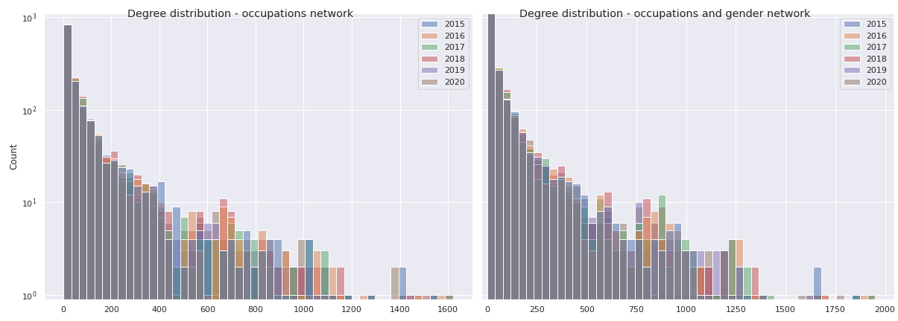
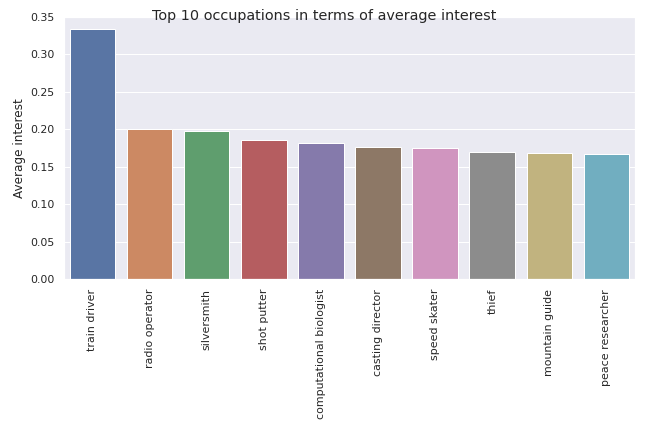
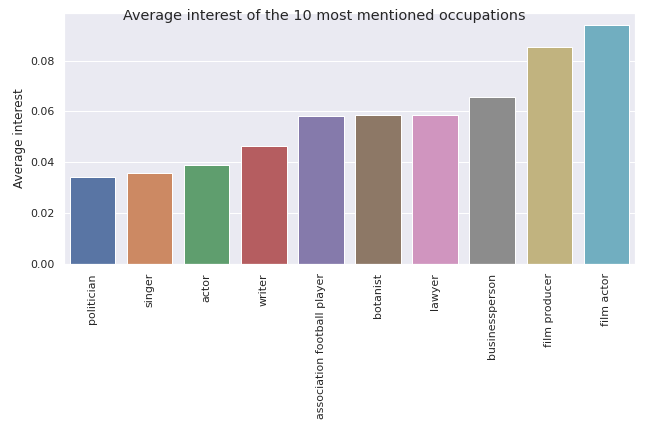
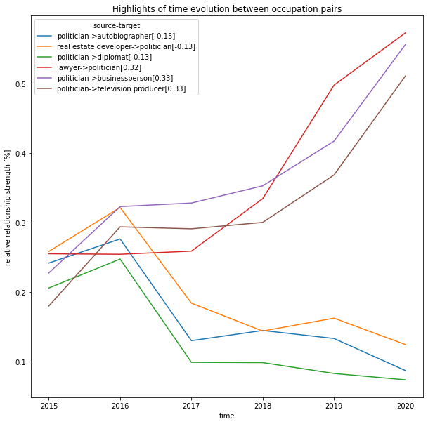

## Introduction 

Well-known people are often mentioned by other well-known people. This ***"has mentioned"*** relationship can take place in multiple contexts for multiple reasons, but in the end we expect musicians to talk about music producers more often than about zoologists. But how often do we talk about politicians ? Actors ? Are women mentioned as often as men ? Do women talk about one another more often that they talk about men ? Do we mention female politicians as we mention male ones ? 

This brings us to the question, **Who talks about who ?** In this article, we propose to study and understand the relationships between individuals grouped by their occupations and gender. To do so, we establish a directed graph of relationships between speakers and people mentioned in the quotations from the Quotebank dataset. In particular, some of the questions that will be answered in this article are:

* Are we more interested in people whose occupation is closer to ours ?
* How does gender impact these relationships ? Does the impact vary with the occupation ?
* Are these relationships likely to change over time ?

## The data

In this study we use the Quotebank dataset, a dataset of 178 million unique, speaker-attributed quotations that were extracted from 196 million English news articles crawled from over **377 thousand web domains** between August 2008 and April 2020. We focus on the years **2015 to 2020**. 

Using SpaCy, we extract 100 000 quotations for each year, in which a **speaker** mentions another person, called the **subject**. After cleaning, we get the following amount of samples:

| Year | Number of quotations | Number of speakers | Number of subjects |
| --- | --- | --- | --- |
|2015|17997|8458|6975|
|2016|19702|8272|6726|
|2017|18084|8502|6950|
|2018|17757|8322|6932|
|2019|17448|7794|6379|
|2020|19445|7263|6083|

&nbsp;

## Some occupations are at the heart of the relationships…

We computed a directed graph representing the relationships between the different occupations. **A node N corresponds to a single occupation** (e.g. 'politician', 'actor'). Its size indicates the amount of unique people (either speaker, subject or both) whose occupations include N. It is common for the people included in the data to have multiple occupations.  

  An edge between two nodes A and B indicates that at least once someone of occupation A mentioned someone of occupation B. However, the graph is almost complete as it only takes a single quotation for an edge to be created. The following charts show the network's degree distribution:

Those distributions are **heavily** skewed, far from the usual real-world network. This means two things:
- We can't display all edges.
- The existence of an edge between two nodes does not on its own represent very valuable information. That's why we deal with the **weights** of the edges rather than the fact that they exist.

We define the **interest** of an occupation A in an occupation B as the proportion of the quotations whose speaker is A for which the subject is B. Said in a more natural manner, the *interest* reflects the probability that "*when A talks, it's about B*". The total interest coming out of an occupation is necessarily 1.  
The interests are indicated in the network by the edges' widths and opacities:

<h3>The Interest of occupations for one another</h3>
<h4>This graph is interactive - Zoom in and try to select and displace nodes to feel the weights of its edges, indicating the interest in the associated occupation</h4>
<h5>
 Network indicating the "has mentioned" relationship between all occupations that include at least 60 people. The weight of edges indicate the interest of the source occupation in the destination occupation. For a node N, an edge E is displayed only if its weight reaches the 95%-percentile of the weights of all edges coming out of N.</h5>
<iframe src="./docs/html_graphs/nt_occupation_2015.html"  width=800 height=780 id="graph1" title="The Interest of occupations for one another"></iframe>

The graph is highly connected and has numerous occupations which are not distributed in the same way with some being more present than others, such as politicians compared to sport cyclists.

What about relationships ? There are a lot of them where in particular, some occupations seem to be at the heart of attention such as politicians, writers, singers or actors. Besides some relationships are common sense, as for example, we can see that sports managers and coaches are mostly addressing to sportives. Furthermore, some relationships are very inclusive, that is to say, that people with the same occupation are more likely to refer to each other, which is notably the case for football players. 

Let's **explore** which occupations get the most **interest**, with different meanings for *"most"*.
First, a quick view at the **total interest** of the occupations: if we sum all of the interest of all occupations in all other occupations, which ones get the highest scores ? Which occupations does the society overall care most about ?

Politicians and singers ! What a surprise ! This list can be interpreted as *the occupations that the population talks the most about overall*. But how about the **average interest** ? If we take a single occupation A, how much do the other occupations care about A *on average* ?

Well well well ! No politicians, singers or actors anymore. We now obtain some very **specific** occupations. But then one question arises, how much do people care about the 'most famous' occupations on average ?

It appears that the average interests of the occupations in politicians, singers and actors are a little under 4%.  
**What can we conclude ?**  
Let's say you have a random occupation. On average, **you will mention a politician 4% of the time you mention someone**. Nevertheless, **there is most likely another rather specific occupation linked to yours, which you will talk about a lot more often** (perhaps train driver or speed skater).

However **pretty much everyone talks about politicians, while you might be the only one to mention skate drivers**. Thus (and as expected !) the politicians get more attention if you consider the whole social environment as a whole.

## … and often very gendered ones.

Now what does the data tell us about the visibility of men, women and other genders in the media in general according to their occupation?

Below is a directed graph represening the **interactions between speakers and subjects** but this time the graph is generated with the **occupation and gender of each person** as a comparison key. Nodes and edges in blue and red concern respectively males and females.

<h3>Interest network based on occupation and gender</h3>
<h5>Nodes including less than 60 people, were not displayed. Other genders than 'male' and 'female' were all included in the process but were not displayed due to the lack of enough individuals of those genders in the dataset. While those formed very clear clusters, the lack of data prevented any conclusion.</h5>
<iframe src="./docs/html_graphs/nt_occupation_gender_2015.html" width=800 height=780></iframe>

Compared to the graph with the occupation as a comparison key, **2 clusters are clearly visible : the "female cluster" and the "male cluster"**. Both are very connected within themselves, very far apart from each other and highlight several differences between males and females. 

At first we can see that the female and male clusters have very different sizes. If we take a closer look on the data we can see that, indeed, women are very underrepresented in this dataset.

 |
:--- | --- :
| ||

Indeed **women are the origin of less than 20 % of the quotes** that are reported in the media and are **5 times less likely than men to be spoken** about in the media.

We now have a closer look at the graph and want to know what are the occupations of the women represented in the media compared to men.

**Let's start with women's occupations**.

Most of the women present in the media are artists. There are also a few politicians.
We notice that although on repartition quite a lot of women which said quotes are involved in politics (throughout the years  always more than 17%) or are researchers, business persons, most of the women names found in quotes are artists. And women politicians are way more represented as speakers than as subjects. 

**Now what about men's occupations?**

Most of the men present in the media are politicians, artists and sports players. They are much more represented than females in the different occupations and especially in science and sport as well as religion. 

**Finally, what about relationships between males and females ?** The graph shows a real separation and gap in communication between them where it is mostly the people attached to the public domain who are closest to the men. The artistic field does not escape it, where women don’t communicate much with men, even in the same field. As a whole, relationships between individuals are very gendered according to the occupation that each one occupies. 
Is it really that men only talk about other men and women only talk about other women?

We have provided the following graph created with the 2015 dataset:



In fact we can see that in general **a woman is 4 times more likely than a man to speak about another woman**. 
Focusing on occupation, we remark that for the male subjects a lot of the speakers are politicians. This is not always true for women (for example if the subject is a female singer). On the contrary, women tend to talk as much about women as men. 

Still, gender inequality subsists with fewer women in the spotlight than men. We illustrate this by looking at the subjects that are actors. We can be surprised than when the subject is an actor there are still very few women (30%). This is not representative of what we see in cinemas. This may be indeed due to the place of women in the movie industry, where they do not always have the first or an interesting role. So far in 2021 only 57.6% of movies pass the <a href="https://en.wikipedia.org/wiki/Bechdel_test">Bechdel test</a>.

## Towards an evolution in time 

Below is a plot based on the difference between relative connection strengths between 2015 and 2020 for every occupation pairs. The relative connection strength (weight), as said before, is a value between 0 and 1 which estimates the importance of a relationship in a given direction.  As an example, if 0.2 (20%) of politicians have mentionned writers in 2015 compared to 0.22 (22%) in 2020, then there is an increase of 0.2 (2%) of politicians who have mentionned writers. As we can see, the differences are mostly around 0, showing that the relationships have not really evolved within the occupations.

Nevertheless, as some have changed, let’s select the first six relationships that have the most changed between 2015 and 2020. 

According to the plot above, we can see that politicians have lost interest to mention autobiographers and diplomats between 2016 and 2020 with a decrease of about 13% and 15%. Nevertheless, there is an evolution (strong one !) of interest towards business people and television producers with an increase of about 33% between 2015 and 2016. At last, we can see an increase of 32%  for the relationship of lawyers talking to politicians.

