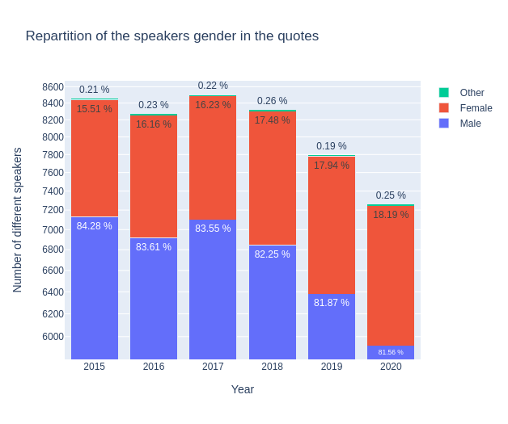
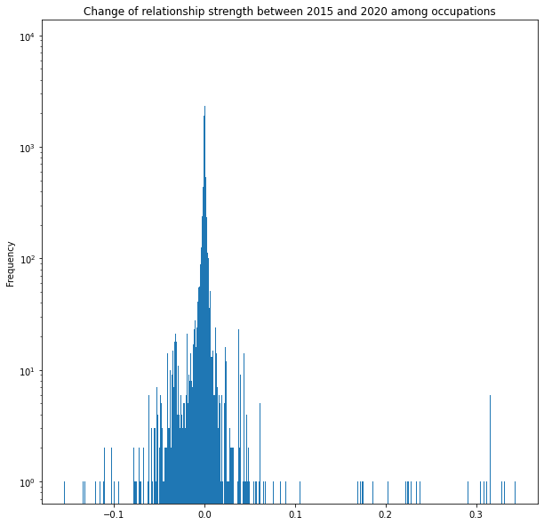

## Introduction 

It is very often the case that well-known personalities are quoted in speeches given by other individuals, creating a **directional relationship from a speaker to a subject**. These relationships occur between two persons with different characteristics, for example their occupation and their gender. As a result, these relationships can be multiple with (very) different natures, where some of these are perhaps more present than others.

This brings us to the question, **how are these relationships distributed?** In this article, we propose to study and understand the relationships between several individuals according to the occupation and gender of each person involved in a relationship. To do so, we want to establish a directed graph of relationships between speakers and people mentioned in the quotations. In particular, some of the questions that will be answered in this article are:

* Are these relationships uniform, i.e., involving people of the same occupation?
* How are the genders represented according to occupation in each relationship?
* Are these relationships likely to change over time?

## The data

In this study we use the Quotebank dataset, a dataset of 178 million unique, speaker-attributed quotations that were extracted from 196 million English news articles crawled from over **377 thousand web domains** between August 2008 and April 2020. We will focus on the years of **2015 to 2020**. 

Using SpaCy, we extract 100 000 quotations for each year (2015 to 2020) in which a speaker is talking about a human subject. After cleaning, we get the following amount of samples:

| Year | Number of quotations | Number of speakers | Number of subjects |
| --- | --- | --- | --- |
|2015|17997|8458|6975|
|2016|19702|8272|6726|
|2017|18084|8502|6950|
|2018|17757|8322|6932|
|2019|17448|7794|6379|
|2020|19445|7263|6083|

&nbsp;

## Some occupations are at the heart of the relationships…

Below is a directed graph representing the relationships between the different occupations. **A node corresponds N to a single occupation** (e.g. 'politician', 'actor'). Its size indicates the amount of unique people (either speaker, subject or both) whose occupations include N. It is common for the people included in the data to have multiple occupations.
An edge between nodes A and B indicates that someone of occupation A mentioned someone of occupation B at least once. However the edges are also weighted between 0 and 1: an edge A->B of weight 0.25 indicates that in 25% of the quotations whose speaker's occupations include A, the subject has occupation B. The weight of the edges are indicated by their opacity and width.

<iframe src="./docs/html_graphs/nt_occupation_2015.html"  width=800 height=1200 id="graph1"></iframe>

Of what we can see, the graph is highly connected and fits in one piece with numerous occupations which are not distributed in the same way with some being more present than others, such as politicians compared to sport cyclists. 

What about relationships ? There are a lot of them where in particular, some occupations seem to be at the heart of attention such as politicians, writers, singers or actors, as indeed, these are the occupations that most people with other occupations refer to. On the other hand, some relationships are common sense, as for example, we can see that sports managers and coaches are mostly addressing to sportives. Also, some relationships are very inclusive, that is to say, that people with the same occupation are more likely to refer to each other, it is notably the case for football players. 

## … and often very gendered ones. (Part 2)

Now what the data tells us about the visibility of men, women and other genders in the media in general according to their occupation?

Below is a directed graph represening the **interactions between speakers and subjects** but this time the graph is generated with the**occupation and gender of each person** as a comparison key. Nodes and edges in blue and red concern respectively males and females.

<iframe src="./docs/html_graphs/nt_occupation_gender_2015.html" width=800 height=1200></iframe>

Compared to the graph with the occupation as a comparison key, **2 clusters are clearly visible : the "female cluster" and the "male cluster"**. Both are very connected within themselves, very far apart from each other and highlight several differences between males and females. 

At first we can see that the female and male clusters have very different sizes. And if we take a closer look on the data we can see that, indeed, women are very underrepresented in this dataset.

 |
:--- | --- :
| ||

Indeed **women are the origin of less than 20 % of the quotes** that are reported in the media and are **5 times less likely than men to be spoken** about in the media.

We now have a closer look at the graph and want to know what are the occupations of the women represented in the media compared to men.

**Let's start with the women occupations**.

Most of the women present in the media are artists. There is also a few politicians.
We notice that although on repartition quite a lot of women which said quotes are involved in politics (throughout the years  always more than 17%) or are researchers, business persons, most of the women names found in quotes are artists. And women politicians are way more represented as speakers than as subjects. 

**Now what about the men occupations?**

Most of the men present in the media are politicians, artists and sports players. They are much more represented than female in the different occupations and especially in science and sport as well as religion. 

**Finally, what about relationships between males and females?** The graph shows a real separation and gap in communication between them where it is mostly the people attached to the public domain who are closest to the men. The artistic field does not escape it, where women don’t communicate much with men, even in the same field. On the whole, relationships between individuals are very gendered ones according to the occupation that each one occupies. 
Is it really that men only talk about other men and women only talk about other women?

We provide the following graph: eudaozmehs

<iframe src="./docs/Gender_occ_subjects.html"  width=800 height=1200 id="graph1"></iframe>

In fact we can see that in general a women is 3 times more likely that a men to speak about another women. Now let's see what happens if we focus on an occupation in particular.

## Towards an evolution in time (Part 3)

We were interested in how the relationships evolve over time. We computed the difference between the relative connection strength between 2015 and 2020 for every occupation pairs and plotted on histogram. The majority of the pairs are having close to zero change over time, therefore we can conclude that our graphs remain similiar over time. 

Although we can mention some highlights, for example politicians tend to lose interest in publicly mentioning diplomats and autobiographers, but are focusing more on businesspeople and television producers over the last 5-6 years.

